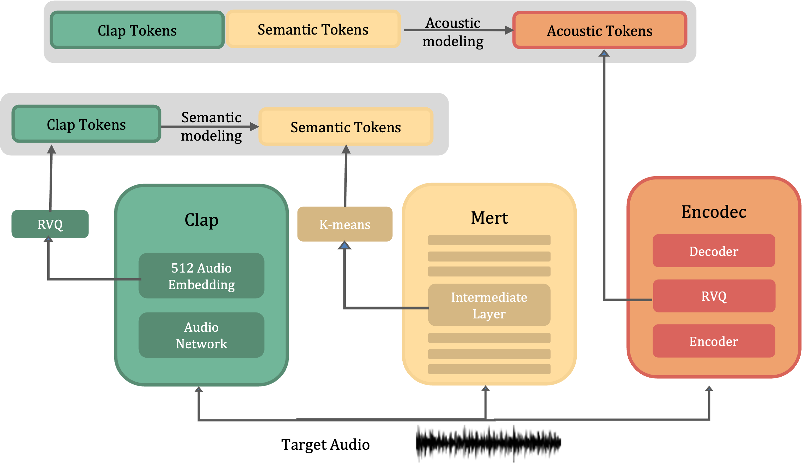
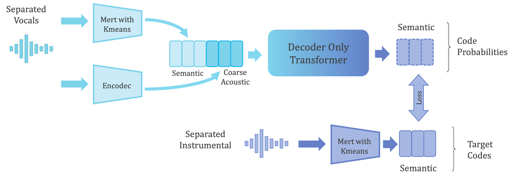
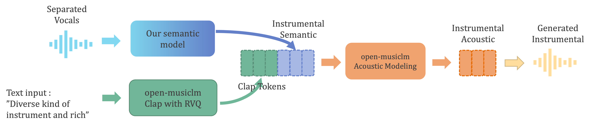

# [Open-Singsong](https://jihoojung0106.github.io/posts/OpenSingsong/)

This is the unoffical implementation of "SingSong: Generating musical accompaniments from singing" from Google research.
Demos and more details can be found in [here](https://jihoojung0106.github.io/posts/OpenSingsong/).
We'll employ two models for the implementation of Singsong:
- Open-musiclm [here](https://github.com/zhvng/open-musiclm): An unofficial implementation of the MusicLM paper, complete with pre-trained weights. We'll utilize this without any modifications.
  

- Our semcoarsetosem model: Developed by us, this model predicts instrumental semantic tokens from MERT based on vocal input.
  

- Inference will follow the process outlined in the following figure.
  

## Checkpoints
- Open-musiclm : You can download experimental kmeans_10s_no_fusion.joblib, clap.rvq.950_no_fusion.pt, fine.transformer.24000.pt, semantic.transformer.14000.pt, coarse.transformer.18000.pt in [here](https://drive.google.com/drive/u/0/folders/1347glwEc-6XWulfU7NGrFrYTvTnjeVJE). Refer to the open-musicLM [here](https://github.com/zhvng/open-musiclm) for more information. Plus, please download 630k-audioset-best.pt from [here](https://drive.google.com/drive/folders/1D6ZR5S6M5yoNXaJm35U2s-Rh6YofHrpQ?usp=sharing) and put it in ./open_musiclm/laion_clap/630k-audioset-best.pt
- Our semcoarsetosem model: You can download real_semcoarsetosem.transformer.5170.pt in [here](https://drive.google.com/drive/folders/1D6ZR5S6M5yoNXaJm35U2s-Rh6YofHrpQ?usp=sharing)

## inference
Correctly change all the file path and run inference.ipynb

## train
Correctly change all the file path and run train.ipynb
